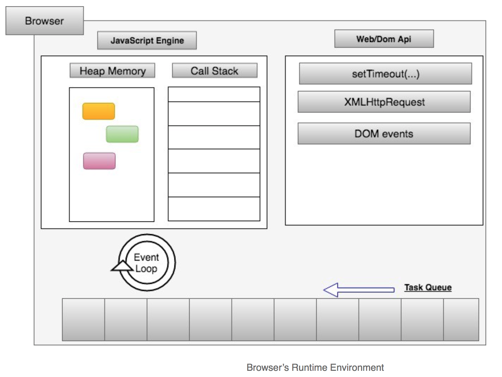
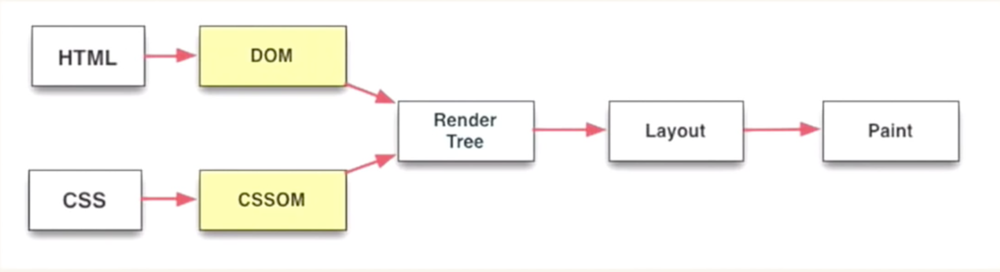

 * [About JavaScript](About-JavaScript.md#about-javascript)
   * [JavaScript Engine](About-JavaScript.md#javascript-engine)
      * [Different JavaScript Engines](About-JavaScript.md#different-javascript-engines)
   * [Rendering Engine](About-JavaScript.md#rendering-engine)
   * [Event Loop](About-JavaScript.md#event-loop)
   * [Job Queue](About-JavaScript.md#job-queue)
   * [Asynchronous execution](About-JavaScript.md#asynchronous-execution)
      * [1. Callback](About-JavaScript.md#1-callback)
         * [Drawbacks of <em>callback pattern</em>:](About-JavaScript.md#drawbacks-of-callback-pattern)
      * [2. Promise](About-JavaScript.md#2-promise)
         * [Promise examples](About-JavaScript.md#promise-examples)
   * [Performance](About-JavaScript.md#performance)
      * [Web Workers](About-JavaScript.md#web-workers)
         * [Dedicated worker](About-JavaScript.md#dedicated-worker)
            * [Data transfer](About-JavaScript.md#data-transfer)
               * [Structured cloning (pass by value)](About-JavaScript.md#structured-cloning-pass-by-value)
               * [Transferable Interface (pass by reference)](About-JavaScript.md#transferable-interface-pass-by-reference)
         * [Shared worker](About-JavaScript.md#shared-worker)
   * [Interesting Reads](About-JavaScript.md#interesting-reads)


# About JavaScript
- JavaScript is a **single threaded, non blocking, asynchronous, concurrent, and general purpose scripting language**.
-   **Ecma International** is an organization that creates standards for technologies. They have created several standards for various technologies, whereas the standard code named as **ECMA 262** defines a scripting language specification called **ECMAScript** through a Technical Committee - TC 39. JavaScript is an implementation of ECMAScript.
-   **ECMA 262** is a standard, for example, similar to QWERTY layout standard. Every keyboard manufacturers can make their own brand of keyboard compliant to QWERTY layout standard. Similarly, the specification provided by ECMA 262 standard known as ECMAScript provides the rules, standards and guidelines on making a scripting language to be considered as ECMAScript compliant. ES2015, ES2016 etc are different versions of ECMA 262 standard.
-   A **scripting language** is a programming language designed to act specifically on an external entity.  For example JavaScript is a scripting language targeting at external entities such as browser, node.js server etc.
-   Reading _ECMAScript specification_ helps to understand how to make a scripting language like JavaScript. Reading _JavaScript documentation_ helps to understand how to use this script language to get things done.
- JavaScript **has one call stack** _one call stack === one thread === only one thing is executed at a time_
- JavaScript **has one task queue** aka **callback queue**
    _The items in the **callback queue** would be shifted into **event loop** during its turn, and which is then pushed to the **call stack** for execution at another turn._
- JavaScript **has one micro task queue** aka **job queue)**
    _Jobs like **Promise** would wait in microtask queue instead of callback queue to get priority attention. So, when a call stack is empty microtask queue is first pushed into call stack before looking into task queue_
- Javacript **has one event loop**
    when call stack is empty, event loop moves one item from either of the following into call stack based on some rules:
  
  - the callback queue, or 
  - the micro task queue, or
  - the renderer queue
  
    This event loop enables **concurrency in JavaScript** as you could at the same time scroll down to load new content from Ajax, click on a button to fire some action, keypress to trigger some other actions and so on.
- JavaScript has one **renderer queue**
    The browser is constrained by what we’re doing in JavaScript. It would like to repaint the screen every 16.6ms (or 60 frames/second). But it can’t actually do a render if there’s code on the stack.
- **Host environment** provides many extra APIs to JavaScript. For example:
  
  - Node.js is a server side host environment for JavaScript, which gives several APIs such as FileSystem, Process etc. 
  - Browser is a host environment which gives Web APIs to JavaScript. The following actions are handled by **Web APIs:**
    -   user fired events such as mouse click, DOM events, keyboard events
    -   AJAX
    -   network events (online, offline)
    -   timer events like function called from setTimeout etc

<br/>
    
# JavaScript Engine
-   A JavaScript engine is a program that understands and executes JavaScript in Browser, Server, IoT device etc. Examples for JavaScript engines in a Browser are: _V8 engine for Chrome_, _Chakra for Edge_, _SpiderMonkey for FIrefox_.  
-   JavaScript Engine for Browser and Server consume high memory and gives high speed of execution. _Eg: V8_
-   JavaScript Engine for IoT takes low memory and gives low speed of execution. _Eg: Duktape, JerryScript_
-   V8 engine for JavaScript is very fast because the JavaScript code is directly translated to machine code by V8 by using a JIT. There is no intermediate code (interpreted code), hence making the execution very fast. So, even in Node.js server you don't need to compile JavaScript code to intermediate code ahead of time like how Java does. In Java _AOT (Ahead of Time) compilation_ of java code is done by _Javac_ compiler to produce an intermediate code.
-   JavaScript Engine is single threaded, and very good for writing a non blocking program for server using Node.js. But, if you need high performance computing Node.js isn't good because it doesn't utilize maximum CPU because it has only a single thread.
-   A JavaScript engine can work on different runtime environments. _Eg: V8 engine works for Chrome as well as Node.js server_.
-   A JavaScript runtime is an environment which provides a host of
    objects for JavaScript to operate on, and is executed by JavaScript
    engine. So, Browser is a JavaScript runtime which provides a host of
    objects such as window, document, HTML elements etc which is
    operated on by JavaScript, and is executed by a JavaScript engine
    inside this JavaScript runtime environment. It is the runtime
    environment (browser) that provides the web apis to work on these
    host of objects.

| Language   | Runtime | Engine which executes code |
| ---------- | ------- | -------------------------- |
| Java       | JRE     | JVM                        |
| JavaScript | Node    | V8                         |
| JavaScript | Browser | V8                         |

## Different JavaScript Engines


| Engines                    | Sponsors                                                      | Built using |
| -------------------------- | ------------------------------------------------------------- | ----------- |
| V8                         | Maintained by Google as open source, used by Chrome & Node.Js | C++         |
| SpiderMonkey               | Started by Netscape, maintained today by Firefox              |             |
| Rhino                      | Maintained by Mozilla Foundation as open source               | Java        |
| JavaScriptCore (aka Nitro) | Maintained by Apple for Safari                                |
| Chakra                     | IE, Edge                                                      |             |
| JerryScript                | IoT                                                           |             |
| Nashorn                    | open source as part of OpenJDK by Oracle                      |             |
| KJS                        | for KDE, used by Konqueror                                    |             |

# Rendering Engine

<br/>

This is how browser renders a web page.

1.  **DOM tree** is created by rendering engine by parsing HTML document
2.  **Render tree** is created by rendering engine by parsing CSS rules
    in the document & external stylesheets, and combing it with the DOM
    tree. This render tree is a tree of rectangles in the order of HTML
    elements in document with each one carrying CSS attributes such as
    color, dimensions etc.
3.  **Layout** process will apply geometrical positioning to each node
    in render tree by giving exact coordinates to each nodes on screen.
4.  **Painting** is the process where each node in Render tree is
    traversed and painted on screen.

# Event Loop

**JavaScript engine** is not working alone. It resides inside a _hosting environment_. JavaScript engine doesn't have an innate sense of time. It is the hosting environment that schedules code snippets to run by adding them to **event loop**. JavaScript engine simply executes whatever snippets of code is given to it. If the file contains only a programs which are meant to be run sequentially, they are executed in a single stretch. But, if the program is met with asynchronous functions, JavaScript engine executes those functions and ask host environment to put callback into the event loop queue once response data needed by the callback function is ready.

**Eg 1**: When a `setTimeout` function is processed, JavaScript engine executes that code, and handover callback function to the hosting environment which keeps it aside for the configured period of timeout, and then pushes the callback of setTimeout function into the event loop.

**Eg 2**: When an Ajax function is run, JavaScript engine would execute the function and realize that it is demanding a callback when there is data. So, it asks the hosting environment to invoke the callback when there is response coming back from the Ajax request. Once there is data, hosting environment would put that callback function into event loop - which is executed by JavaScript engine. So, the asynchronous nature of JavaScript was achieved with the help of hosting environment until ES6. Then, **Promise** arrived, for which there is a nuanced behaviour with the introduction of **Job queue**.

You can assume the way JavaScript engine works in the event loop is similar to the way human brain works. Human's aren't capable fo multi-tasking. All what a human brain does at the forefront of minds is to simply do context-switching.

# Job Queue

Each iteration of *event loop* is called a *tick*, where the next item to execute is picked from Task queue and is put into execution. When you have a callback function ready for execution (from ajax or setTimeout) it is put into the end of this Task queue. But, if you use **ES6 Promise, it helps to put callback functions into the end of current tick itself**. You can thus put more items into this queue forming a special *Job queue* which is guaranteed to execute after current tick and before picking up next item in the event loop. But, if you continuously add items into the Job queue then you end up with same situation like an infinite loop preventing next item in event loop to be executed.

# Asynchronous execution
You can create async in your program using **callback**, **promise** & **web workers**. EventHandlers, AJAX handlers are common built-in examples of async in JavaScript. Even though callback brings asynchrony to JavaScript, it is still single threaded. Web workers are used to achieve async in multi-threaded execution environment.

## 1. Callback

When there are a couple of ajax calls waiting to operate on a shared data, then both competes to reach first in performing callback function. This is a special condition called *race condition*.

In JavaScript also there is **non deterministic ordering of functions**. In order to prevent race condition and to
bring ordering of callbacks, it is necessary to explicitly coordinate
callbacks. Here are a few examples on how to achieve coordination on
concurrent processes in JavaScript.

**A case of non deterministic result**

``` js
var res = [];

function response(data) {
    res.push(data);
}

ajax("url 1", response);
ajax("url 2", response);
```

**Solution**

``` js
var res = [];

function response(data) {
    if (res.url == 'url 1') {
        res[0] = data;
    }
    if (res.url == 'url 2') {
        res[1] = data;
    }
}

ajax("url 1", response);
ajax("url 2", response);
```

**Gate**

``` js
// Another solution is "gate"
// i.e, if (a && b) then {}
// this is regardless of whether "process a" finish first or "process b" finish first
```

**Latch**

``` js
// Another solution is "latch"
// i.e, if (!a) then {}
// this would allow only the first comer in two concurrent processes
```

**Async scheduling by breaking down a long process into sequence of small processes**

``` js
// Another solution is to "break down a long process into sequence of small tasks"
// It allows to interleave these small tasks with other tasks waiting in queue for the event loop

function response(bigData) {
    if (bigData.length > 0) {
        let chunk = bigData.splice(0, 1000);
        // process chunk
    } else {
        return;
    }


    setTimeout(function () {
        response(bigData);
    }, 0);
}

ajax('url', response);

// Trick : This "setTimeout hack" is a technique for "async scheduling", 
// which simply means to stick the function in setTimeout to the end of current callback queue
// so as to consider whatever events happened during the processing of a chunk of data.

// Drawback : There is actually no guarantee on the order of the execution of these async scheduled queue of events, 
// similar to "nextTick of nodejs"
```

**Micro Task queue aka Job queue**

``` js
console.log("A");

setTimeout(function () {
    console.log("B");
}, 0);

// theoretical job API
job(function () {
    console.log("C");

    job(function () {
        console.log("D");
    });
});

// Output will be
// A
// C
// D
// B
// Because, "B" goes into callback queue for event loop to pick it up.
// But, "C" & "D" goes into the jobs queue which is processed before taking up next item from callback queue.

// ---------------------------------------

// Example of Micro Task queue using Promise
console.log('A');

const p1 = new Promise((resolve) => {
  console.log('B');

  resolve('C');
});

p1.then((value) => {
  console.log(value);
});

console.log('D');

// Output will be
// A
// B
// D
// C

// ----------------------------------------------------

// Same above example with a fetch request
console.log('A');

const p1 = new Promise((resolve) => {
  console.log('B');

  fetch('https://support.oneskyapp.com/hc/en-us/article_attachments/202761627/example_1.json')
    .then((response) => response.json())
    .then((data) => {
      resolve(data);
    });
});

p1.then((value) => {
  console.log(value);
});

console.log('D');

// A
// B
// D
// JSON payload


```
- Callbacks are the simplest form of asynchronous implementation. But, it is not the most elegant form because of the following concerns:

### Drawbacks of _callback pattern_:
  - Callbacks are not easy to contemplate by human brain. They doesn't let human brain to think in sequential manner. Certainly when the levels of callbacks go deeper in a large program with several of such repetitions, it is not going to be anywhere near comprehensible.
  - Another drawback is the trust issue because of _inversion of control_. A callback function may be invoked by a 3rd party code. You don't have any control over it. They may fail to call your code, or call multiple times, or call too early, or call lately, or miss some parameters necessary for the call.
- These disadvantages calls for the need for a better asynchronous orchestration - that's **ES6 Promise**.

## 2. Promise

Instead of leaving the life of a callback invocation into the hands of asynchronous API (eg: ajax 3rd party API), it is quite anticipated to have a mechanism to understand when the asynchronous API's work is finished. This is what a Promise offers us. Promise let us to sequentially think and work based on the _future value_ now itself.

### Promise examples 
```JavaScript
/* eslint-disable prefer-promise-reject-errors */

// 1. 'simple resolve --------------------------------------------------------';
const p1 = new Promise((resolve, reject) => {
  resolve('p1 resolved');
});
p1.then((resolvedValue, rejectedValue) => {
  if (resolvedValue) console.log(resolvedValue);
  if (rejectedValue) console.log(rejectedValue);
});

// 'simple reject ---------------------------------------------------------';
const p2 = new Promise((resolve, reject) => {
  reject('p2 rejected');
});
p2.then(
  resolvedValue => {
    console.log(resolvedValue);
  },
  rejectedValue => {
    console.log(rejectedValue);
  }
);
// 'simple reject, catch it ---------------------------------------------------------';
const p2x = new Promise((resolve, reject) => {
  reject('p2x rejected');
});
p2x.catch(rejectedValue => {
  console.log(rejectedValue);
});

// 'resolve, and finally ---------------------------------------------------';
const p3 = new Promise((resolve, reject) => {
  resolve('p3 resolved');
});
p3.then((resolvedValue, rejectedValue) => {
  if (resolvedValue) console.log(resolvedValue);
  if (rejectedValue) console.log(rejectedValue);
}).finally(() => {
  console.log('Finally of p3');
});

// 'wait for ALL promises, all are resolved  --------------------------------'
// 'wait for ALL promises, if any is rejected, then the WHOLE is rejected ----------------------------------
Promise.all([p1, p3]).then(
  resolvedValue => {
    console.log(resolvedValue);
  },
  rejectedValue => {
    console.log(rejectedValue);
  }
);

// 'race with ALL promises, only first fulfillment or rejection (whichever comes first) is considered ---------------------------'
Promise.race([p1, p2]).then(
  resolvedValue => {
    console.log(resolvedValue);
  },
  rejectedValue => {
    console.log(rejectedValue);
  }
);
```
# Performance
JavaScript doesn't have multi-threading feature, but for performance sake if there was a possibility to run a piece of program in parallell which doesn't need to share resource with main program, that would be pretty useful. HTML5 realized this opportunity and introduced _Web Workers_. 

## Web Workers

Web workers are way to achieve async in must-threaded execution
environment. Web workers isn't a feature of JavaScript and also that
JavaScript is not multi-threaded. But, browser provides web worker so
that you can achieve multi-threading capability to JavaScript by
leveraging it. Normally, there is only a single thread to perform both
the DOM rendering and all other JavaScript code execution in a page.
But, when you introduce web worker you can use it to perform all the
Non-DOM JavaScript code execution in a separate thread to work in
parallel and later interact with the main thread via postMesage. 

A worker thread is a feature provided by hosting environment (browser), its not part of JavaScript because there is no multi-threading in JavaScript. 

### Dedicated worker

The worker threads are like a separate browser instance with separate JavaScript engine and works on a separate process as compared to the main program. You can create a dedicated worker from main program or from another worker as follows:

```JavaScript
const w1 = new Worker('path.tofile.js'); // also accepts binary blob of JS file instead of file itself.
w1.addEventListener('message',(data)=>{
    console.log(data);
})
w1.postMessage(data);
```
You can offload activities such as loading several scripts, other high network traffic, image processing, complex CPU intensive math calculation etc in the worker thread. And, once data is processed it can be send back to main program through message events. 

#### Data transfer

##### Structured cloning (pass by value)
Data transfer through message events simply works by copying information from source to destination (main -> worker or worker-> main) using **structured cloning algorithm**. This is memory intensive because your data has to be copied, thus doubling size in memory. 

##### Transferable Interface (pass by reference)
New age workers are efficient to simply change ownership of data instead of copying from one location to another. Hence, the only condition for that data is that it should implement _Transferable_ interface.

If an app/page using worker is opened in multiple tabs of browser, it causes duplication of workers, which is performance bound. This can be fixed using _Shared Workers_.

### Shared worker
A shared worker can operate with several source/target programs in shared state using a single worker. To identify browser tab/instance of page is facilitated using _ports_. When you create a worker from a tab to the JavaScript file/blob, Shared worker is instantiated and connects to that tab via a port. Similarly, any other tabs will connect with different ports to the same shared worker.

---

**Additional Notes**


- While you log data to console for debugging purpose, it may occur that data logged via `console.log(data)` is not showing correct value as expected. This is because, as it is an I/O bound operation, browser tends to run it in the background asynchronously, hence logging actually works at a later point of time, and by then the logged values might have already been changed. Better alternatives are :
  - use breakpoints 
  - save snapshots of objects by using `JSON.stringify(data)`

- JavaScript doesn't have multi-threading concept. Hence, the execution of a code snippet follows the rule of **run to completion** except for ES6 generators.


# Interesting Reads

1.  https://itnext.io/achieving-parallelism-in-JavaScript-using-web-workers-8f921f2d26db 
    (A great article on web workers)
2.  https://www.joji.me/en-us/blog/performance-issue-of-using-massive-transferable-objects-in-web-worker 
    (Transfer speed of large data between web worker and main thread)
3.  https://github.com/deebloo/things-you-can-do-in-a-web-worker
    (Things you can do with a web worker)
4.  https://www.html5rocks.com/en/tutorials/file/filesystem-sync/\#toc-download-xhr2
       (Download files using web worker)
5.  https://developer.mozilla.org/en-US/docs/Web/API/Web_Workers_API/Using_web_workers
    (Using web workers)
6.  https://developer.mozilla.org/en-US/docs/Web/API/Web\_Workers\_API/Functions\_and\_classes\_available\_to\_workers
    (APIs available in the web workers)
7.  https://blog.sessionstack.com/how-does-JavaScript-actually-work-part-1-b0bacc073cf
8.  [JavaScript's Call Stack, Callback Queue, and Event Loop](https://www.youtube.com/watch?v=8aGhZQkoFbQ)
9.  [Loupe tool for live demo](http://latentflip.com/loupe/?code=JC5vbignYnV0dG9uJywgJ2NsaWNrJywgZnVuY3Rpb24gb25DbGljaygpIHsKICAgIHNldFRpbWVvdXQoZnVuY3Rpb24gdGltZXIoKSB7CiAgICAgICAgY29uc29sZS5sb2coJ1lvdSBjbGlja2VkIHRoZSBidXR0b24hJyk7ICAgIAogICAgfSwgMjAwMCk7Cn0pOwoKY29uc29sZS5sb2coIkhpISIpOwoKc2V0VGltZW91dChmdW5jdGlvbiB0aW1lb3V0KCkgewogICAgY29uc29sZS5sb2coIkNsaWNrIHRoZSBidXR0b24hIik7Cn0sIDUwMDApOwoKY29uc29sZS5sb2coIldlbGNvbWUgdG8gbG91cGUuIik7!!!PGJ1dHRvbj5DbGljayBtZSE8L2J1dHRvbj4%3D)
10. [Very detailed explanation on event loop, callback queue and micro task queue](https://www.zeolearn.com/magazine/JavaScript-how-is-callback-execution-strategy-for-promises-different-than-dom-events-callback)
11. [Overview of JavaScript engine, runtime and call stack ](https://blog.sessionstack.com/how-does-JavaScript-actually-work-part-1-b0bacc073cf)
12. [Excellent example on making blocking infinite recursion to cool infinite non blocking recursion](https://stackoverflow.com/questions/39459236/understanding-event-queue-and-call-stack-in-JavaScript)
13. [Kyle Simpson's series of JavaScript books](https://github.com/getify/You-Dont-Know-JS)

