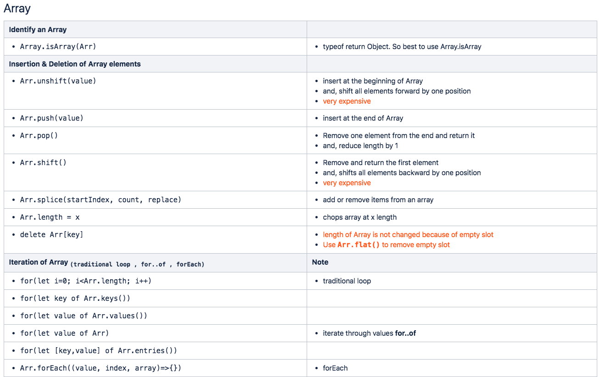
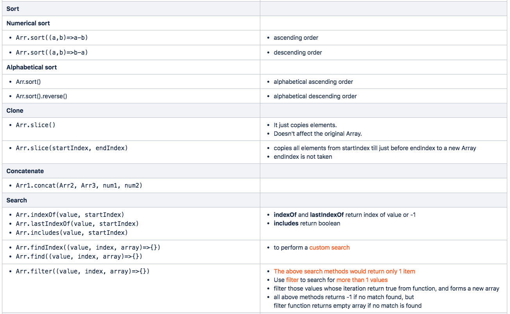
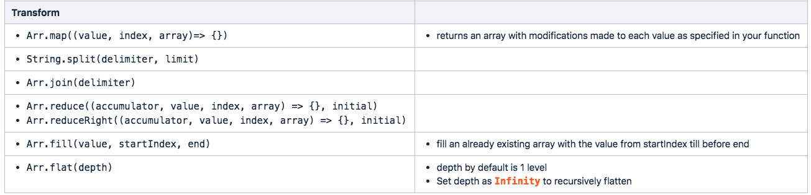
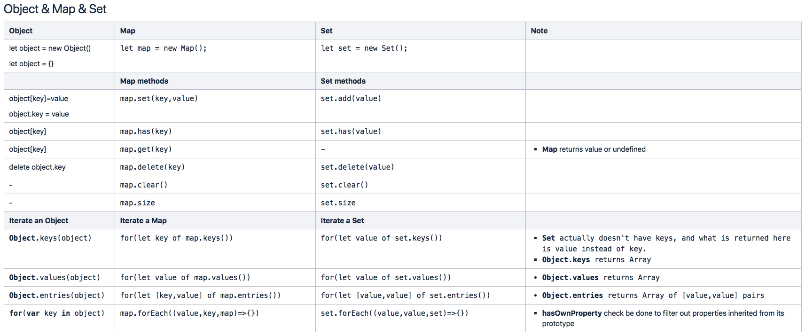

# Array

In JavaScript, every Objects including Arrays are passed by reference

```javascript
let A = [1,3,5];
let B = A;
A.splice(1,1,10);
what is B ? // B is also [1,10,5] because assigning arrays works as pass by reference

A.length=0;
What is B ? // B is empty array [] because array A is []
```







# Map



## Difference between Map and Object

Map is similar to Object but with a few more features. Map is similar to associative arrays in PHP.

1. Map can have keys of any type whereas Object can have only string keys.
   Map can have a string, number, boolean or even an object as a key. But, Object would convert anything into a string as key. So for eg:

```javascript
//Demonstration of object key for an Object
let john = {
  name: 'john',
  id: 1,
};

let O1 = {};
O1[john] = 100;
// the key john would become as {[object Object]: 100}

// Demonstration of object key for a map
let map = new Map();
map.set(john, 100);
console.log(map.get(john)); // 100
```

2. Map iterates in the same order as how elements are inserted whereas for objects there is no order.

3. Map has `size` property but, Object doesn't have size property

## Convert an Object to a Map

```javascript
let fruits = {
  apple: 1,
  banana: 5,
  orange: 3,
};
let fruitsMap = new Map(Object.entries(fruits));
fruitsMap.get('banana'); // 5
```

## Convert a Map to an Object

```javascript
let fruitsMap = new Map([
  ['apple', 1],
  ['banana', 5],
  ['orange', 3],
]);

let fruits = Object.fromEntries(fruitsMap.entries());
```

# Set

Set is similar to Map with the following major changes.

- A Set has a unique collection of items. Even if you add same value multiple times, set adds that value only once.
- There is no keys for Set

```javascript
let set = new Set([iterable]);
let set = new Set(Object.values(fruits));
let set = new Set(myArray);
```
