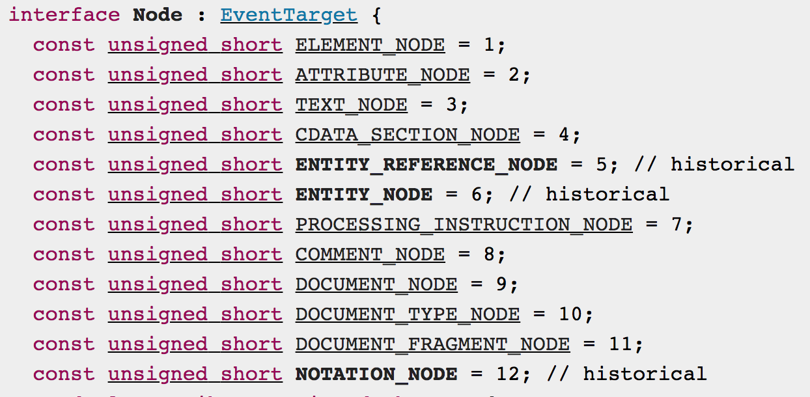
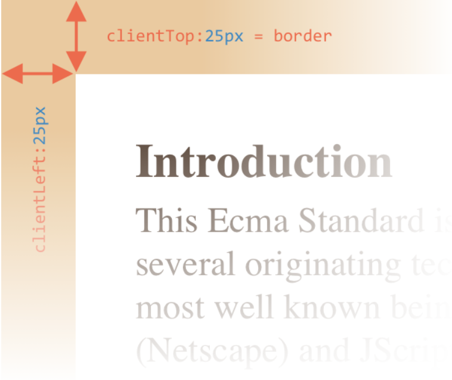
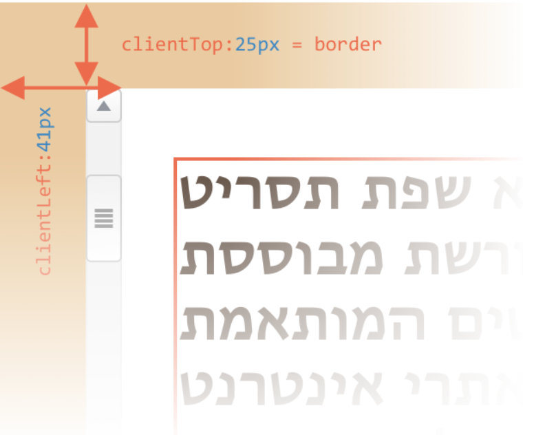
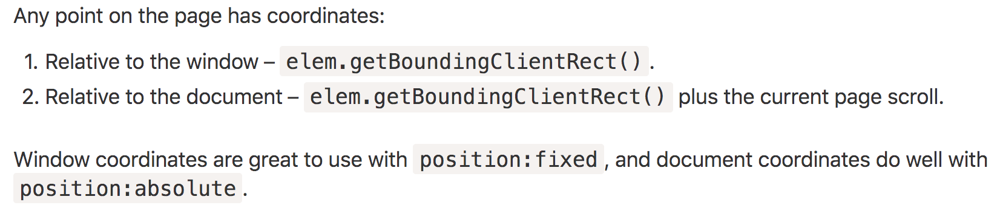
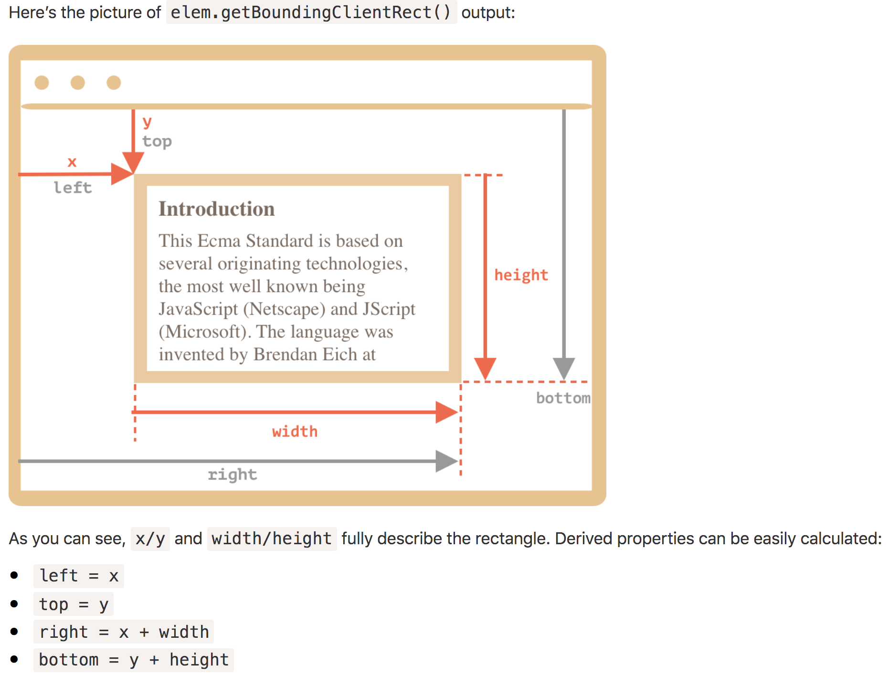

* [Browser environment](DOM.md#browser-environment)
* [Document Object Model](DOM.md#document-object-model)
    * [DOM Tree](DOM.md#dom-tree)
    * [DOM Traversal](DOM.md#dom-traversal)
    * [Search inside DOM](DOM.md#search-inside-dom)
    * [DOM node classes](DOM.md#dom-node-classes)
    * [Node](DOM.md#node)
    * [Attributes](DOM.md#attributes)
    * [Custom Attributes](DOM.md#custom-attributes)
    * [Modify DOM](DOM.md#modify-dom)
    * [Modify style using JavaScript](DOM.md#modify-style-using-javascript)
    * [Geometric properties pertaining to an element](DOM.md#geometric-properties-pertaining-to-an-element)
    * [Geometric properties pertaining to the document](DOM.md#geometric-properties-pertaining-to-the-document)
    * [Document and resource loading](DOM.md#document-and-resource-loading)
    * [Range and Selection](DOM.md#range-and-selection)
        * [Range](DOM.md#range)
        * [Selection](DOM.md#selection)
* [References](DOM.md#references)

# Browser environment

 <br/>

DOM is not only for browsers. A server program can walk through DOM.

# Document Object Model

## DOM Tree

- Anything in HTML is represented in it's DOM Tree, which includes even the whitespace, newlines and comments along wiht the tags.
- The DOM tree of a web page starts with root element as `document`. It has two `childNodes` in general:

  - 1. `<!DOCTYPE html>` the doctype
  - 2. `<html>` the entire html

     <br/>

- There are 12 types of nodes in a DOM Tree (doctype, document, element, attribute, text, comment etc)

**Text node**

- Whitespace anywhere inside a `<head>` tag and `<body>` tag is represented as `text` nodes in DOM. And, the whitespace between `<head>` tag and `<body>` tag is also represented as `text` node in DOM. Other whitespaces are ignored.
- The text inside an element is also represented as `text` node.
- So the text node is just a string, which has no children, and is always the leaf node of a DOM tree.

## DOM Traversal

- You can traverse through the DOM in two ways.

| Walk over all types of Nodes (including whitespace, comment, element etc) | Walk over only element Nodes                                             |
| ------------------------------------------------------------------------- | ------------------------------------------------------------------------ |
|      |  |

**Note:**
`document.body.firstChild` may not be your first tag element inside HTML body. It could be a whitespace `text` node if your HTML is formatted with spaces like a normal page. But, `document.body.firstElementChild` is always gonna be the first **tag** element.

 <br/>
 <br/>

- To iterate the nodes collection returned by DOM methods, you can try any of the following:

  - `for..of` iteration on collection
  - `for..in` iteration on collection with `hasOwnProperty` check
  - ordinary `for()` loop iteration on collection
  - convert collection into array and iterate using array methods like: `Array.from`(collection).forEach()

## Search inside DOM

 <br/>\
 <br/>

## DOM node classes

The properties and methods present in a `tag` are inherited from a hierarchy of different classes.
For example, for an anchor tag

- anchor tag specific attributes such as `href` are inherited from `HTMLAnchorElement` class
- common html attributes are inherited from `HTMLElement` class
- `nextElementSibling` property inherited from `Element` class
- `nextSibling` property inherited from `Node` class
- `events` are attributed from `EventTarget` class

 <br/>

A node object is like a regular JavaScript object. So, you can add new properties and methods to it.

You can use `console.log(element)` to explore the **HTML** representing that element,
whereas `console.dir(element)` to display the **object** representing that element.

## Node

- `nodeType`
  <br><br>  <br>
- `nodeValue` / `data` - is used to get content of a nodes (other than element type)
- `nodeName` - is used to get the name of "any nodes" (including element nodes)
- `tagName` - is used to get only the name of "element nodes"
- `innerHTML` - is used to get/set **HTML** content of an element (valide only for element nodes)
- `textContent` - is used to get/set **text** content of an element (all HTML tags are stripped off during get, written as text during set)
- `outerHTML`

## Attributes

You can access the attributes of an element using it's object model like `inputElem.value`. But, some attributes exist only on certain type of nodes. Also, using object model you cannot access custom attributes you added to an element. So, there is a better way to access any attributes.

- `elem.hasAttribute(name)`
- `elem.getAttribute(name)` returns string value of that attribute
- `elem.setAttribute(name,value)`
- `elem.removeAttribute(name)`
- `elem.attributes` - get collection of all attributes as **attribute objects** that inherits from `Attr` class. Then you can call `attrObj.name`, `attrObj.value` to get attribute details.

Attributes are case-insensitive. But, other DOM properties in an element object are case sensitive.

When a user types some `input` element's value, that new value is updated in the DOM object property. But, that will not be updated in attribute. So, attribute always sticks to the value which was present in the HTML. Changes to that can be tracked from object property whereas original value can be tracked from attribute itself.

## Custom Attributes

You can mark any custom value to an element using classes. But, they are least elegant for this use case. Better approach is to use custom attributes. But, there is a catch that as HTML is a living standard, they might introduce an attribute similar to your own custom attribute. To avoid that conflict you can use `data-*` attribute. Any custom attributes you add with prefix `data-` will not conflict as they are reserved for programmers. And, such values are also accessible via `elem.dataset` property.

```
//HTML
<body data-hobby="cycling">

//JavaScript
document.body.dataset.hobby // cycling

//CSS
body[data-hobby] {
    color:red;
}
```

```
//HTML
<body data-professional-hobby="cycling">

//JavaScript
document.body.dataset.professionalHobby // cycling

//CSS
body[data-professional-hobby] {
    color:red;
}
```

## Modify DOM

 <br/>

## Modify style using JavaScript

- `elem.className`
- `elem.classList`
   <br>
- `elem.style.{camel cased css property}`
- `elem.style.cssText` to rewrite css entirely
- `getComputedStyle(elem, [pseudo])`

## Geometric properties pertaining to an element

&nbsp;&nbsp; <br>

- `offsetLeft` and `offsetTop`
  <br> <br>

- `clientLeft` and `clientTop`
  <br> <br>

- `offsetWidth` and `offsetHeight`
  <br> <br>

- `clientWidth` and `clientHeight`
  <br> <br>

- `scrollWidth` and `scrollHeight`
  <br> <br>

- Complete geometry of an element
  <br> <br>
  
  **Summary**
  
  `offset*` is measured from the borderline of element:
  
  1. offsetParent
  2. offsetLeft
  3. offsetTop
  4. offsetWidth
  5. offsetHeight
  
  `client*` is measured from the inner content (content width + padding)
  
  1. clientLeft = borderWidth (but in case of arabic, borderWidth + scrollbar width)
  2. clientWidth = contentWidth + padding

## Geometric properties pertaining to the document

 <br>
 <br>
 <br>
 <br>

## Document and resource loading
The events associated with page load are :
- `DOMContentLoaded` - this event is fired when HTML ad JavaScript is loaded, DOM is ready, and all JavaScript has finished execution. This event can ignore the following modes of script tags  : `<script type="module">` or `async`. At this time both images `` and CSS are not loaded.
- `load` 
- `beforeunload`
- `unload` . At this time, you can send any last moment statistics to server by `navigator.sendBeacon(url,data)`.

**`document.readyState`**

There are 3 ready states which indicates different stages of page load. 
- `loading`
- `interactive` is at the same time as `DOMContentLoaded` event fires
- `complete` is at the same time as `load` event fires

Yuo can listen to these document state changes from event `readystatechange`.

**Load scripts in `defer` & `async` mode**

When HTML is followed by `<script>` tag, script gets access to the DOM rendered from HTML above. But, if a `<script>` is before HTML, then it doesn't get visibility to those HTML. Also, browser would wait for the `<script>` to load and run before parsing rest of HTML.

To improve this, it is better to write `<script>` tags at the end of document. But, there are even better strategies:

1. `defer` attribute on `<script>` tag lets browser to load that script only after all the HTML has been loaded already. But, this works only if there is an `src` attribute to load JavaScript externally. `DOMContentLoaded` event will fire only after `defer` scripts are also loaded.
2. `async` attribute on `<script>` tag works completely independent. It may load even before HTML is loaded, or may load later. So, use this approach only for DOM independent scripts such loading advertisement, google analytics etc. `DOMContentLoaded` event doesn't care about `async` scripts.

When you dynaically create `<script>` using JavaScript and insert into document, it works like an `async` script. To change it into a regular script, use property `<script-element>.async = false`.

**Track loading of external resources**
Any external loading of resources - `<script src="">` or `` or `<iframe>` can be tracked using two events :
- `load` - fires on that element when loading is completed successfully
- `error` - fires on that element when loading fails. An exception to this is `<iframe>` which fires only `load` even if it fails.
You can use `window.onerror` to catch any JavaScript errors in page.

## Range and Selection

### Range

Create a new Range object

`let range = new Range();`

Range object properties:

- `range.startContainer`
- `range.startOffset`
- `range.endContainer`
- `range.endOffset`
- `range.commonAncestorContainer`

Range object methods to select nodes:

- `range.setStart(node.offset)`
- `range.setEnd(node,offset)`
- `range.setStartBefore(node)`
- `range.setEndBefore(node)`
- `range.selectNode(node)`
- `range.selectNodeContents(node)`
- `range.cloneRange()`

Range object methods to manipulate nodes:

- `range.deleteContents()`
- `range.extractContents()`
- `range.cloneContents()`
- `range.insertNode(node)`
- `range.surroundContents(node)`
- `range.collapse(toStart)`

### Selection

Selection events
- `selectstart`
- `selectionchange`

Selection methods to operate on Range

- `selection.getRangeAt(index)`
- `selection.addRange(range)`
- `selection.removeRange(range)`
- `selection.removeAllRanges()`

Form input selection properties:

- `input.selectionStart`
- `input.selectionEnd`

Form input selection methods:

- `input.select()`
- `input.setRangeText(replacement)`

Form input selection events:

- `select`

Example to add range to document selection;

```javascript
let range = new Range();
range.setStart(node,offset);
range.setEnd(node,offset);

let selection = document.getSelection();
selection.removeAllRanges()
selection.addRange(range);
```    
# References
- [List of all possible CSS selectors](https://drafts.csswg.org/selectors/#overview)
