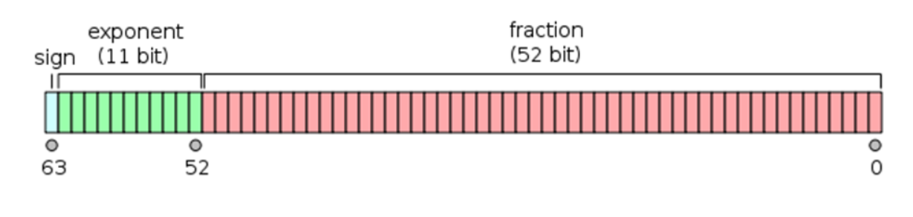

   * [Objects](https://github.com/jojijacobk/About-Javascript/blob/master/Object-&-Prototype.md#objects)
      * [Built in objects](https://github.com/jojijacobk/About-Javascript/blob/master/Object-&-Prototype.md#built-in-objects)
      * [Primitive literals](https://github.com/jojijacobk/About-Javascript/blob/master/Object-&-Prototype.md#primitive-literals)
      * [Contents of Object](https://github.com/jojijacobk/About-Javascript/blob/master/Object-&-Prototype.md#contents-of-object)
      * [Arrays](https://github.com/jojijacobk/About-Javascript/blob/master/Object-&-Prototype.md#arrays)
      * [Duplicating Objects](https://github.com/jojijacobk/About-Javascript/blob/master/Object-&-Prototype.md#duplicating-objects)
      * [Property Descriptors](https://github.com/jojijacobk/About-Javascript/blob/master/Object-&-Prototype.md#property-descriptors)
   * [Types](https://github.com/jojijacobk/About-Javascript/blob/master/Object-&-Prototype.md#types)
   * [Function](https://github.com/jojijacobk/About-Javascript/blob/master/Object-&-Prototype.md#function)
   * [Inheritance](https://github.com/jojijacobk/About-Javascript/blob/master/Object-&-Prototype.md#inheritance)
      * [Mixin](https://github.com/jojijacobk/About-Javascript/blob/master/Object-&-Prototype.md#mixin)
         * [Explicit mixin ](https://github.com/jojijacobk/About-Javascript/blob/master/Object-&-Prototype.md#explicit-mixin)
         * [Implicit mixin ](https://github.com/jojijacobk/About-Javascript/blob/master/Object-&-Prototype.md#implicit-mixin)
      * [Prototypal Inheritance](https://github.com/jojijacobk/About-Javascript/blob/master/Object-&-Prototype.md#prototypal-inheritance)

# Objects

Objects can be created in two ways :

-   **object literal** syntax. 
    -   Adv: add numerous properties at once.
-   constructed **new Object()** form.

## Built in objects

1.  String
2.  Number
3.  Boolean
4.  Function
5.  Array
6.  Object
7.  Date
8.  RegExp
9.  Error 

## Primitive literals

They are coerced into object wrapper by JS engine when necessary. so it
is preferred than built in objects.

-   String, Number, Boolean are those
-   null & undefined have **NO object wrapper** form
-   Date has only constructor object form
-   Object, Array, Function, RegExp are all objects regardless of
    whether made via literal form or constructor form

## Contents of Object

-   **property names are always string**. if you put anything else, that
    is coerced to string
-   **access via dot** - (aka property access) - limitation to naming as
    compatible identifier
-   **access via `["name"]`** - (aka key access) - anything unicode
    supported
-   **computed property names** introduced in ES6 even for Object
    literal expression
-   ES 6 Symbols can be used as a computed name

## Arrays

-   Adding properties to Array object doesn't increase size of array
    because it only adds property to array object, and not to array
    container
-   Arrays are **good for numerically indexed contents** whereas objects
    are good for key-value store, where value can be objects or its sub
    types

## Duplicating Objects

-   To do shallow clone of an object, all you need to do is **ensure that an object is JSON safe**  
    `var clone= JSON.parse(JSON.stringify(obj))`
    OR  
    `var clone = Object.assign( {},obj1, obj2 ...)`

## Property Descriptors

-   Object.defineProperty
-   Object.getOwnPropertyDescriptors
-   Immutability
    -   Object property as constant = Writable false + Configurable false
    -   Prevent Extensions
    -   Seal = Prevent Extensions + Configurable false
    -   Freeze = Prevent Extensions + Writable false
    -   Deep Freeze = Recursively (Prevent Extensions + Writable false)

-   Getter & Setter
    -   If you try to access a non existent property in an object, it
        shows undefined. Whereas if you try to access a non existent
        variable, it shows ReferenceError: is not defined
    -   Existence check
        -   in operator. eg: ("a" in myObj); Dive deep into prototype
            chain
        -   hasOwnProperty check. DOESN'T Dive into prototype chain
    -   Enumeration
        -   for(var i in Obj) - loop through enumerable keys
        -   for(var v of Obj) - loop through values
        -   forEach(myObject) - loop through each item, and pass value
            into a callback function, never mind about return value of
            callback
        -   every(myObject)   - loop through each item, and pass value
            into a callback function, breaks when return value of
            callback is falsy
        -   some(myObject)    - loop through each item, and pass value
            into a callback function, breaks when return value of
            callback is truthy
        -   Object.keys() → gets enumerable keys
        -   myObject.propertyIsEnumerable("x") 
        -   If Array is just numerically indexed, it is good to have
            traditional iteration based on length
        -   If you want to enumerate an Object, you can go with for(var
            i in myObject) style iteration

# Types

-   6 Primary Types are there in javascript language   
    -   5 are primitives - string, number, boolean, null, undefined
        -   null - isn't object, its a bug
    -   6th is  Object
        -   sub types
            -   array (**structured contents** as compared to object)
            -   function (**callable object** - aka "first class"
                objects)

**Number**

-   In javascript, numbers are represented using Number data type. 
-   A number is 64 bit floating point representation of a number.
    -   1 bit for sign
    -   11 bits for exponents
    -   52 bits for the integer part of number

<br/>

-   The way floating point data types handle fractions is different than
    human calculation because they represent a fraction in binary form
    where there is no exact equivalent for some fraction values.   
    So, for eg: `.2 + .1` is not `.3`, but `0.30000000000000004`  
    To fix this issue you can use `.toFixed()`  
    like `(0.2+0.1).toFixed(1)`  
-   The highest possible integer value that can be handled by a Number
    type in javascript is `Number.MAX_SAFE_INTEGER`. Similarly,
    `Number.MIN_SAFE_INTEGER`
-   If you are going to work on high precision math, make use of some
    libraries which purely serve this purpose.

**Short-circuit evaluation**

-   `x || y` **fallback** to `y` if `x` is falsy
-   `x && y`  **pick** the last value if all `x, y` are truthy
-   right side part is evaluated only if necessary

**Bindings/Variables**

-   name of a binding 
    -   can start with **alphabets, _ , $**
    -   **can't** start with number or any other symbols
    -   **can't** be a reserved word

                
# Function

-   In javascript functions can have properties. So you can assign
    properties to a function just by referring
    **`<functionName>.<propertyName>`**
-   Every javascript functions holds a special property called
    **`<functionName>`**.**`prototype`** which is used to set
    the **`[[Prototype]]` of instance objects** created from that
    function by invoking function with `new` operator. So, whatever
    properties added to the prototype of a function would eventually
    appear in the \[\[Prototype\]\] of instance objects.
-   In javascript there is no such thing like methods you can see in a
    class of OO language. Instead **functions inside an object are also
    assigned to properties** similar to how properties do store values. 
-   As the functions in a javascript object is essentially a property,
    it exhibits the **property shadowing in case of functions too.**
-   But, reference to `this operator` inside a function of an object
    would only represents the context of the last object in the
    prototypal chain even if the function is inherited from some deep
    inner level prototype.

**Different levels of properties in a javascript function**

``` js
function doSomething() {
    // This is an instance property. Every objects comes with this value by default. 
    //So it creates duplicate memory footprint from each objects.
    this.myInstanceProperty = "instance property";
}
// This property is directly accessible inside all instance objects without duplicated memory footprint. 
doSomething.prototype.myPrototypeProperty = "prototype property";
// This is like a static variable of a class in OO languages.
doSomething.myStaticProperty = "class static property";
```

**"this" operator inside prototype's methods have context of object
instance**

``` js
function Graph() {
    this.vertices = [];
    this.edges = [];
  }
  
  Graph.prototype = {
    addVertex: function(v) {
      this.vertices.push(v);
    }
  };
  
  var g = new Graph();
  // g is an object with own properties 'vertices' and 'edges'.
  // g.[[Prototype]] is the value of Graph.prototype when new Graph() is executed.
  // "this" operator in addVertex Graph.prototype.method holds context of object g
```

**Create new objects by using Object.create(\<prototype\>)**

``` js
var a = {a: 1}; 
// a ---> Object.prototype ---> null

var b = Object.create(a);
// b ---> a ---> Object.prototype ---> null
console.log(b.a); // 1 (inherited)

var d = Object.create(null);
// d ---> null
// this is the cleanest object with nothing inside

console.log(d.hasOwnProperty); 
// undefined, because d doesn't inherit from Object.prototype
```

**Internals of object creation**

``` js
//When you call
var o = new Foo();
//JavaScript actually just does
var o = new Object();
o.[[Prototype]] = Foo.prototype;
Foo.call(o);
```

# Inheritance

-   Javascript doesn't offer Class based OO similar to other OO
    languages. Even the class syntax introduced in ES6 is just a
    syntactic sugar. 
-   Javascript do only have objects (and no classes per say).

## Mixin

You can circumvent the Prototypal Inheritance with Mixin

- ### Explicit mixin 

    -   Extend

        In various popular libraries extend is a custom
        implementation to simply copy properties (including
        functions) from one object to another. **Note:** be aware
        that even though we copy properties(including functions) ,
        still the functions are shared references.

    -   Parasitic inheritance

         Another variation is called as  as termed by Doughlas
        Crockford. 

- ### Implicit mixin 

## Prototypal Inheritance

-   A.[[Prototype]] is the representation of an object A's prototype
-   Access prototype of an object
    -   `Object.getPrototype(A)`
    -   `Object.setPrototype(A , protoObject)`
    -   `Object.__proto__`
-   Prototypal inheritance
-   Property shadowing
-   Different levels of properties in a function
    -   Instance properties
    -   Prototype properties
    -   Static properties
-   Internals of constructor function (eg: new f())

**Shadowing Properties**

When you set a property in an object, if that property doesn't exist
directly on that object, there are 3 scenarios reflecting how it works:

1.  If the property is not in the direct object, but present somewhere
    in prototype chain (in writable mode), then new property is set
    directly
2.  If the property is not in the direct object, but present somewhere
    in prototype chain in read only mode, then new property is
    discarded.
    1.  But this would work if you use property descriptors instead of
        assignment operator
3.  If the property is not in the direct object, but a setter is present
    in direct object, then new property is not set, but the setter is
    invoked.


|Class oriented OO languages (PHP, Java etc)|Javascript|
|----------|-------|
|When you make an instance (lets say instance "a" from constructor "Foo"), <br/> `var a = new Foo();` <br/> object `a` copies characteristics of "Foo" into "a".| Every objects are linked to its `[[Prototype]]` object. So, when you make an instance (lets say instance "a" from constructor "Foo"), <br/> `var a = new Foo();` <br/> object `a` is not actually copying characteristics of "Foo" into "a" like in other OO languages. Instead instance "a" is `[[Prototype]] linked` to Foo.|
| So if 10 instance objects are made, 10 `copies` of FOO are made.|So if 10 instance objects are made, `10 [[Prototype]] linkages` to this common FOO object are made.|

-   `__proto__` is non standard way of getting/setting prototype of an object |
-   `Object.create(null) - best for dictionary```
-   Foo.prototype.isPrototypeOf(new Bar())

-   Inheritance in Javascript works through prototype. By convention the
    prototype of `someObject` is designated by notation
    `someObject.[[Prototype]]`.
-   Every objects in Javascript except the top most object (
    `The Object` ) in prototype chain holds a private property
    **`__proto__`** which links to that object's own prototype object. 
-   Though **`someObject.[[Prototype]]`** is the standard way of
    denoting prototype of an object, it is equivalent
    to `someObject.__proto__ `that you see in console.

**Standard way of interacting with the prototype of an object is :**

``` js
Object.getPrototypeOf(obj)
Object.setPrototypeOf(obj,proto)
```

**Prototypal Inheritance. Prototype Chain.**

``` js
let inp1 = document.getElementById('inp1');
// Object inp1 holds a private property __proto__ 
// that links to the prototype of object inp1 which can be obtained by
let p1 = Object.getPrototypeOf(inp1);
// Object p1 holds a link to the prototype of object p1, which is object HTMLInputElement
let p2 = Object.getPrototypeOf(p1);
// Object p2 holds a link to the prototype of object p2, which is object HTMLElement
let p3 = Object.getPrototypeOf(p2);
// Object p3 holds a link to the prototype of object p3, which is object Element
let p4 = Object.getPrototypeOf(p3);
// Object p4 holds a link to the prototype of object p4, which is object Node
let p5 = Object.getPrototypeOf(p4);
// Object p5 holds a link to the prototype of object p5, which is object EventTarget
let p6 = Object.getPrototypeOf(p5);
// Object p6 holds a link to the prototype of object p6, which is object Object, 
// this is the end of protype chain
```

**Prototypal Inheritance example**

``` js
// Let's create an object o from function f with its own properties a and b:
let f = function () {
    this.a = 1;
    this.b = 2;
 }
 
 let o = new f(); // {a: 1, b: 2}
 
 // add properties in f function's prototype
 f.prototype.b = 3;
 f.prototype.c = 4;
 
 // do not set the prototype f.prototype = {b:3,c:4}; this will break the prototype chain
 // o.[[Prototype]] has properties b and c.
 // o.[[Prototype]].[[Prototype]] is Object.prototype.
 // Finally, o.[[Prototype]].[[Prototype]].[[Prototype]] is null.
 // This is the end of the prototype chain, as null,
 // by definition, has no [[Prototype]].
 // Thus, the full prototype chain looks like:
 // {a: 1, b: 2} ---> {b: 3, c: 4} ---> Object.prototype ---> null
 
 console.log(o.a); // 1
 // Is there an 'a' own property on o? Yes, and its value is 1.
 
 console.log(o.b); // 2
 // Is there a 'b' own property on o? Yes, and its value is 2.
 // The prototype also has a 'b' property, but it's not visited. 
 // This is called Property Shadowing
 
 console.log(o.c); // 4
 // Is there a 'c' own property on o? No, check its prototype.
 // Is there a 'c' own property on o.[[Prototype]]? Yes, its value is 4.
 
 console.log(o.d); // undefined
 // Is there a 'd' own property on o? No, check its prototype.
 // Is there a 'd' own property on o.[[Prototype]]? No, check its prototype.
 // o.[[Prototype]].[[Prototype]] is Object.prototype and there is no 'd' property by default, check its prototype.
 // o.[[Prototype]].[[Prototype]].[[Prototype]] is null, stop searching,
 // no property found, return undefined.
```
